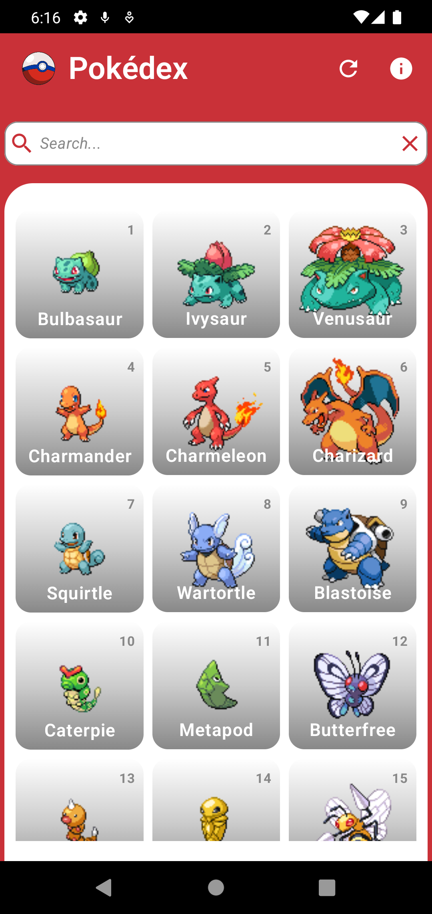
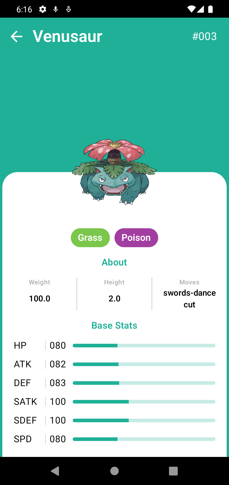
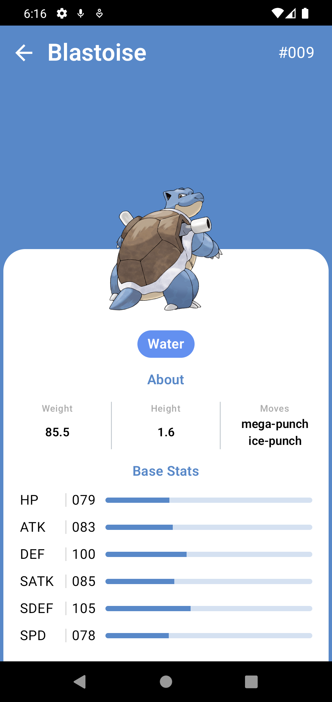

# PokeDex

Aplicación Android sencilla y funcional para visualizar información sobre Pokémon, utilizando la [PokeAPI](https://pokeapi.co/).

## Stack Tecnológico

*   **UI**: Jetpack Compose (Modern Toolkit)
*   **Arquitectura**: MVVM (Model-View-ViewModel)
*   **Inyección de Dependencias**: Koin
*   **Red**: Retrofit + Gson
*   **Navegación**: Compose Navigation
*   **Carga de Imágenes**: Coil
*   **Almacenamiento Local**: SharedPreferences (gestionado a través de `StoreManager`)
*   **Otras librerías**:
    *   Palette API (para la generación de colores dinámicos en la UI basados en las imágenes)
    *   Kotlin Coroutines (asincronía)

## Características del Proyecto

*   **Paginación**: Carga de la lista de Pokémon de forma incremental.
*   **Búsqueda**: Búsqueda de Pokémon específicos por nombre.
*   **Pantalla de Detalles**: Información detallada sobre estadísticas, tipos y características.
*   **Diseño Dinámico**: Los colores de la interfaz se adaptan al color predominante de cada Pokémon (usando Palette).
*   **Manejo de Errores**: Implementación de un `ResultWrapper` personalizado para una comunicación segura entre capas y gestión de excepciones.
*   **Inyección de Dependencias**: Configuración limpia mediante Koin (módulos: `networkModule`, `dataModule`, `viewModelModule`).

## Capturas de Pantalla

## Estructura del Proyecto

*   `data/` — Servicios API, Repositorio y StoreManager.
*   `ui/` — Componentes de Compose, temas y pantallas.
*   `vm/` — Lógica de negocio (ViewModels).
*   `models/` — Clases de datos (POJO).
*   `navigation/` — Configuración de rutas y grafo de navegación.
*   `util/` — Utilidades (Logger, ResultWrapper).
